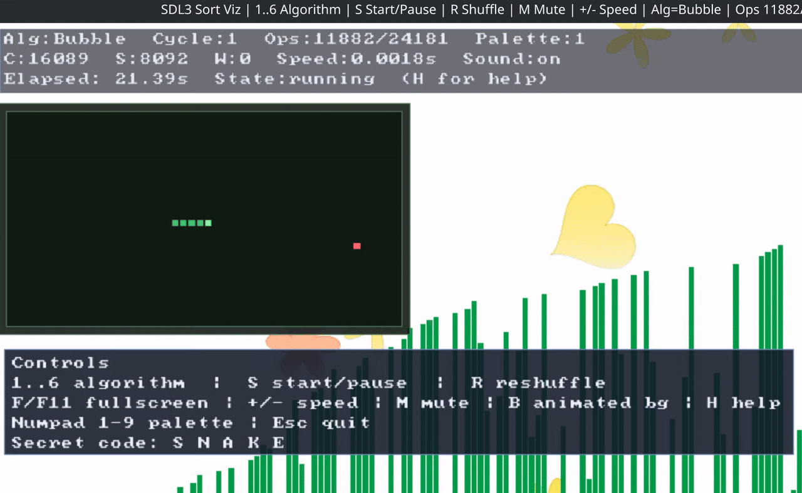

# Notice

Everything exept this text, including the headers below this, is vibecode slop.

The purpose of this repo is not a product, but as example code to reference when making SDL games.

I have made a ton of SDL games in the past, but one thing I struggled with was menus.

I'm not a lawyer, I don't claim any of this vibecode is mine and intend for it only to be a fun helpful way to learn menus as windows. The program does things like place multiple virtual windows and runs the windows as separate processes with the option to pause other processes on demand. It also scales these UI elements appropriately. For those reasons, I believe this information is helpful if you're learning SDL, so I'm sharing it.

I don't know what the actual rules are as far as an SDL3 package under release goes. SDL3 is under the zlib license to my knowledge. If I'm violating any rules, make a PR with a correction or contact me at stambtx@proton.me.


Demo:




# Vibecode: UI Test From Hell

Interactive SDL3 playground featuring:
- Sorting visualizer with multiple algorithms
- Audio feedback
- Animated background mode
- Snake easter egg (fullscreen + PiP)

## Build

### Linux
```bash
make
```

Run:
```bash
make run
```

### Windows cross-build (from Linux)
```bash
make win
```

Create a demo package folder (exe + optional SDL3.dll):
```bash
make win-package SDL3_DLL=/path/to/SDL3.dll
```

### Linux AppImage

An AppImage is a single executable Linux bundle. For this project, the important
bit is that SDL3 gets copied into the bundle, so the user does not need SDL3
installed system-wide.

You still need SDL3 installed on the build machine so the program can compile:

```bash
make deps
make appdir
```

`make appdir` creates `.build/appimage/AppDir`, which is the staged application
folder. It contains:

- `usr/bin/vibecode_ui_test_from_hell`
- an `AppRun` launcher
- a desktop file
- an icon

To build the final AppImage, download the AppImage packaging tools, then run:

```bash
make appimage-tools
make appimage
```

The output is written to:

```text
bin/vibecode_ui_test_from_hell-<arch>.AppImage
```

`linuxdeploy` scans the executable and copies shared libraries such as SDL3 into
the AppDir. `appimagetool` then compresses that AppDir into the final AppImage
using a downloaded AppImage runtime. The downloaded and extracted packaging
tools are stored under `tools/appimage/`, which is ignored by git. The Makefile
runs the extracted tools so packaging does not depend on FUSE being configured
on the build machine. The AppDir also copies SDL3's license notice from
`/usr/share/licenses/sdl3/LICENSE` when it is available.

Compatibility note: AppImages do not magically avoid the glibc problem. If you
build on a very new rolling distro, the AppImage may not run on older distros.
For broad distribution, build the AppImage on the oldest Linux distro you want
to support, or inside a container based on one.

## Controls

- `1..6` select sorting algorithm
- `S` start/pause
- `R` reshuffle
- `+/-` speed up/down
- `M` mute/unmute
- `B` animated background on/off
- `H` help overlay
- `Numpad 1-9` palette select
- `F` or `F11` fullscreen
- `Esc` quit

Snake easter egg:
- type `S N A K E`
- `Tab` toggles Snake PiP mode
- arrow keys control snake
- `Space` restarts snake when dead
- `X` closes snake mode

## Project Layout

```text
include/    public headers
src/        implementation files
bin/        built binaries
```

## Notes

- Keep `Makefile` in sync when new build targets are added.
- Windows build instructions: see `README-build-windows.md`.
